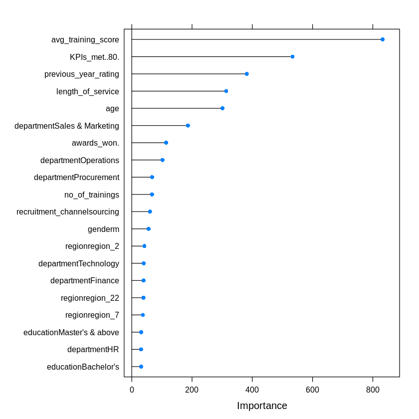

# Introduction

HR analytics[@Quddus2019] in corporations plays a major role in restructuring the operand of their HR department. A company of sizeable proportions deals with hundreds of employee records every day. Although HR analytics has been in operation in companies for years, some of these operations are still done manually. Automating such processes will aid in saving valuable time and increasing overall efficiency in the operation of the company. Eligibility for promotions depends on numerous criteria. These criteria vary between companies and even between departments within a company. Currently, there is no way to automate the process of determining why one employee should be promoted over the other, since such decisions require logical reasoning and understanding the current environmental factors that computers are just not capable of.

Machine Learning has been used to solve similar problems in different domains for several years now. In areas where some kind of human intervention is necessary, a well trained machine learning algorithm has been proven to be an acceptable substitute, if not an ideal solution. Here, we will be using machine learning techniques to not only predict the promotion status of future employees, but to also determine which of the provided attributes from the employees’ data is most relevant to making this prediction. In this paper, we explore the application the two different machine learning algorithms, namely Random Forest[@Breiman2001] and XGBoost[@ChenG16] algorithms, to analyze a publicly available HR dataset and determine what factors help elevate an employee's chances of getting promoted.

In this paper, we have classified the HRM data to predict whether an employee is a viable for a promotion. The data required for this purpose was collected by an anonymous organization and made available to the public through [Kaggle](https://www.kaggle.com). This dataset consists of various differentiating features for previous candidates who were shortlisted for a promotion and whether or not they were promoted. This dataset consists of 14 different attributes or columns, with 54,808 total observations or rows. A comprehensive summary of the dataset is as follows:

* **employee_id(int)**: Unique id of the employee.
* **department(string)**: The department to which the employee belongs to. Possible values are: *Analytics*, *Finance* , *HR* , *Legal* , *Operations*, *Procurement*, *R&D*, *Sales & Marketing*, *Technology*.
* **region(string)**: Region of employment. Possible values are: *region_10*, *region_11*, *region_12*, *region_13*, *region_14*, *region_15*, *region_16*, *region_17*, *region_18*, *region_19*, *region_2*, *region_20*, *region_21*, *region_22*, *region_23*, *region_24*, *region_25*, *region_26*, *region_27*, *region_28*, *region_29*, *region_3*, *region_30*, *region_31*, *region_32*, *region_33*, *region_34*, *region_4*, *region_5*, *region_6*, *region_7*, *region_8*, *region_9*.
* **education(string)**: Describes the level of education of the employee. Possible values are: *Bachelor\*s*, *Below Secondary*, *Master\*s & above*.
* **gender(string)**: Gender of the employee. Possible values are: *f*, *m*.
* **recruitment_channel(string)**: Channel of recruitment of the employee. Possible values are: *referred*, *sourcing*, *other*.
* **no_of trainings(int)**: Describes the number of training programs completed by the employee. Range: from *1* to *10*.
* **age(int)**: Describes the age of the employee. previous_year_rating (int): Employee rating from previous year. Range from *1* to *5*.
* **length_of_service(int)**: The service length of the employee in years.
* **KPIs_met >80%(int)**: Describes whether the employee’s *Key Performance Indicators* score are greater than 80%. Value is *1* if yes, else *0*.
* **awards_won?(int)**: Whether the employee won any awards last year. Value is *1* if yes, else *0*.
* **avg_training_score(int)**: Employee’s average training score in training evaluations.
* **is_promoted(int)**: Whether the employee was promoted or not. Value is *1* if yes, else *0*.

The remainder of the research paper is organized as follows: A literature review documenting past approaches and research similar to that in this paper is represented in Section [2](#literature-review). Section [3](#methodology) provides a detailed description of the working dataset, outlines the preparation of the dataset and elaborates on the two methodologies used in this paper, i.e., Random Forest and XGBoost classifiers. In Section [4](#results), we compare the outcomes of the two methods and elaborately discuss the results. We conclude the paper in Section [5](#conclusion) with references and future work.

# Literature Review

A. H. Marler and J. W. Boudreau in @Marler2017 discuss the adoption of HR analytics by organizations and attempts to answer some key questions regarding its definition, inner workings, effectiveness, its impact on corporate operation and its success factors. They conduct evidence-based reviews of articles in peer-reviewed journals and conclude that the available evidence is too sparse. Z. Jin et al. in @Jin2020 predicts employee turnover for companies using classification algorithms and Survival Analysis. They employ a variation of the Random Forest algorithm named RFRSF, which combines survival analysis for censored data processing and ensemble learning for turnover behavior prediction. The authors contrast the results their model with those of traditional machine learning techniques such as Naïve Bayes, Decision Tree and Random Forest and their algorithm predicts employee turnover with 84.65% accuracy. J. Liu et al. in @Liu2019 employ various supervised learning approaches, utilising Logistic Regression, Random Forest and AdaBoost algorithms. From their analysis, the Random Forest classifier outperforms the other models, with accuracy and AUC of 85.6% and 88.9% respectively along with a precision of 83.4%.
 
# Methodology

## Feature Engineering

First off, we remove the employee_id column as it is just a column to distinguish records by and will not realistically impact the decision of whether an employee is to be promoted or not. This brings down our variable count to 13. 

### Removing Duplicate Values 

Even though we have a large volume of data, we cannot be sure that all the observations in the dataset are unique. Looking at our data, we find that there are 118 duplicate records that are present in our dataset. Even though it does not seem like a significantly large number, duplicate records will negatively impact the training process of machine learning algorithms and may cause them to over-fit. After the removal of the duplicate values, we have 54,690 observations left.

### Removing Missing Values

To deal with missing values, we separate out the observations with a NULL value for at least one variable. We also notice that only two columns, **education** and **previous_year_rating** contain null values in 2398 and 4062 observations, respectively. We rectify this by filling in the missing attribute with the mode of that particular attribute in all the observations where the value of the target variable is the same as in the column with the missing value. This approach allows us to eliminate observations with missing values while still retaining the size of our dataset.

## Preprocessing

The data is pre-processed to make it suitable for our algorithms. Since the target variable is categorical in nature, encode its values using one-hot encoding to optimize our models' performance. One-hot encoding is a method of representing categorical variables in a way which can be parsed by our machine learning models. To do so, we use the integer representation of our target variable, where 0 corresponds to the value *no* and 1 corresponds to the value *yes* and transform them into an array of binary digits whose length is equal to the total number of possible values(2 in our case). The digit in the array whose position corresponds to our integer value is set to 1 while the other values are set to 0, i.e., *0* becomes *[1, 0]*, *1* becomes *[0, 1]* etc.

We also rename the values in the target column from “0” and “1” to “no” and “yes” so that the algorithm recognizes as categorical variables. This will also aid us to make better visualizations of the data.

## Balancing Classes

In this dataset, there is a clear imbalance between the values of our target variables. Out of 54,690 observations, only 4665 observations are of class “no”, while 50,025 observations are of class “yes”. This is a significant issue, as the difference exceeds more than 50% of our total data. For a machine learning algorithm to be properly able to parse and understand the given data, there should ideally be an equal distribution of the number of examples with the different classes that the model is meant to classify data into. When one class takes precedence over the other class in the dataset, the algorithm is less likely to learn what the properties of each class are and tends to forget the less frequent class’ properties all together during training. 

To ensure that this does not happen, we must make sure that there are equal numbers of examples for both the cases. Here, we randomly sample a subset of the data where the class is “yes”, as it is the class with higher frequency and append it to the observations with the class “no” to generate a new, minified training set with equal number of “yes” and “no” observations. This process is called under-sampling. This brings down the size of our dataset to 9330 observations total. Even though it is only a fraction of the original 54,690, it is still a significant amount and should be enough to train our algorithms along with being balanced. The distribution of class percentage before and after under sampling is shown in @fig:class_balancing.

::: {#fig:class_balancing}
{width=49% height=27%}
{width=49% height=27%}

Distribution of *is_promoted* class before and after undersampling
:::

## Training and Evaluation

The dataset is split into a training set and a testing set where the testing set contains 1/5ths of the records in the dataset while the rest belong to the training set. The resultant training and testing sets will therefore have 7464 and 1866 observations respectively.

A Random Forest(RF) and XGBoost(XGB) model will be will be trained on the training set and be evaluated using the K-fold cross-validation method for the testing set. In this case, the value of K is taken to be 5. Confusion matrices will be generated for both models, which will help us determine the accuracy with which the models classify observations as *yes* or *no*.

### Random Forest

The Random Forest is a supervised learning approach that utilizes multiple Decision Trees, each representing a feature or label in the dataset in a random order, to arrive at its final conclusion. The final prediction of the RF model is dependant on the decision trees present in the model. The prediction from each individual tree stored and are polled in the end. The prediction at the end with the highest frequency is selected.

The main drawback with decision trees is their low bias and high variance. The Random Forest algorithm uses this drawback to its advantage and utilizes multiple trees with slight variations. This helps prevent the model from overfitting and allows it to handle much more complex data than decision trees.

The trained RF model yielded tuning parameters which are tabulated in @tbl:rf_params. *Accuracy* was used to select the optimal model using the largest value. The final value used for the model was *mtry* = 28. The Confusion Matrix plots for the predictions from the RF model can be seen in @fig:rf_cf.

Table: Tuning parameters for RF model {#tbl:rf_params}

| mtry | Accuracy  | Kappa     |
|------|-----------|-----------|
| 2    | 0.7600484 | 0.5200968 |
| 28   | 0.8161811 | 0.6323622 |
| 54   | 0.8105528 | 0.6211057 |

::: {#fig:rf_cf}
{width=49% height=25%}
{width=49% height=25%}

Confusion Matrices of RF model evaluated with 5-fold cross-validation
:::

### XGBoost

The XGBoost (short for Extreme Gradient Boosting) algorithm is a variation of the Random Forest concept which utilizes the concept of gradient boosting to enhance the performance of the model. This algorithm performs best when being used to model small to medium sized structured data. The XGBoost algorithm is generally preferred over other conventional algorithms as it combines many different traits from other algorithms, such as bagging, gradient boosting, random forest and decision trees and makes improves upon them through system optimization and algorithmic enhancements such as regularization, sparsity awareness, weighted quartile sketch, and so on.

#### Gradient Boosting

Gradient boosting is a repetitive algorithm used to leverage the patterns of mistakes made by a model to strengthen the model using weak predictions. Basically, the data is modeled very simply and is analyzed for errors to identify data points that are difficult for the model to fit. The model is tweaked to fit better for those particular data points. Finally, this is combined with the original models for an optimal solution.

The Confusion Matrices plotted from the predictions of the XGB model on both the training and testing sets are shown in @fig:xgb_cf

::: {#fig:xgb_cf}
{width=49% height=25%}
{width=49% height=25%}

Confusion Matrices of XBG model evaluated with 5-fold cross-validation
:::

<!--\newpage-->
# Results

The statistics of the final trained models when evaluated on the testing set are tabulated below in @tbl:model_stats

Table: Final statistics of the trained RF and XGB models evaluated on the testing set {#tbl:model_stats}

| Attribute              | RF               | XGB              |
|------------------------|------------------|------------------|
| Accuracy               | 0.8199           | 0.8339           |
| 95% CI                 | (0.8017, 0.8371) | (0.8162, 0.8505) |
| No Information Rate    | 0.5              | 0.5              |
| P-Value [Acc > NIR]    | < 2.2e-16        | < 2.2e-16        |
| Kappa                  | 0.6399           | 0.6677           |
| Mcnemar's Test P-Value | 6.889e-07        | 1.277e-07        |
| Sensitivity            | 0.7706           | 0.7835           |
| Specificity            | 0.8692           | 0.8842           |
| Pos Pred Value         | 0.8549           | 0.8713           |
| Neg Pred Value         | 0.7912           | 0.8033           |
| Prevalence             | 0.5000           | 0.5000           |
| Detection Rate         | 0.3853           | 0.3917           |
| Detection Prevalence   | 0.4507           | 0.4496           |
| Balanced Accuracy      | 0.8199           | 0.8339           |
| 'Positive' Class       | no               | no               |

The *Accuracy* and *Kappa* values of both models are very similar, indicating that both models perform very similarly for this particular dataset. Both models perform consistently over the testing set with regards to their performance on the training set and are able to classify the datapoints. However, the XGB model has an accuracy of 83.39% which is slightly higher than that of the RF model, which is approximately 82%. The XBG model also clearly outperforms the RF model in almost every other aspect, which was as expected.

Both models assign an 'Feature Importance' score to each attribute, which is calculated by the amount that the particular attribute's split point improves the performance measure, weighed by then number of observations the node is responsible for. In our case, the performance measure is the *Gini Index*, which is used to select the splits points. The plots of the 20 most important attributes according to the RF model and the XGB model can be seen in @fig:rf_imp and @fig:xgb_imp respectively.

::: {#fig:imp_feats}
{#fig:rf_imp width=80% height=40%}\
{#fig:xgb_imp width=80% height=40%}

20 most important features as scored by the RF and XGB models
:::

\newpage

We notice that the list of the 10 most important features according to both the Random Forest and XGBoost models are nearly identical with the exception of no_of_trainings and departmentHR. This tells us that the other attributes can be discarded to get improved performance from the models. 

# Conclusion

In this paper, we have demonstrated the use of the Random Forest and XGBoost machine learning algorithms in predicting an employee's promotion status. We also used the trained models to determine which attributes have the most impact on said promotion status. Through this, we can see the use of machine learning as a predictive decision making tool or at least a suggestive tool is a fully viable solution for the presented problem. With fairly limited data and computational resources, we were able to train algorithms to perform with significantly good accuracy. 

Going forward, higher accuracy and more efficient models can be achieved with higher volumes of data and more careful tuning of the models' parameters. We can also improve the models' accuracy by retraining the models on just n-most important features as seen from @fig:imp_feats. Furthermore, we can expand this research by applying various other machine learning approaches, such as Support Vector Machines and Recurrent Neural Networks.

# References
